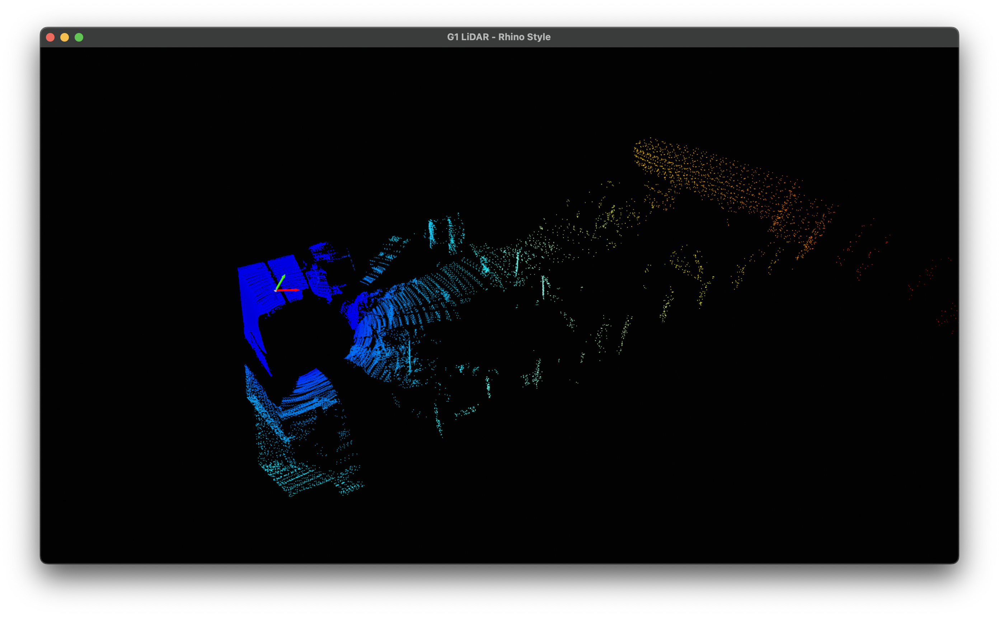

# 🛰️ G1 LiDAR Streaming & Viewer

Real-time 3D point cloud visualization for Livox Mid-360 LiDAR on Unitree G1 Humanoid Robot via Jetson Orin NX.



*Real-time 3D point cloud visualization*


## 🚀 Quick Start

| Step | Command |
|------|---------|
| ① Get Mac IP | `ifconfig \| grep "inet "` |
| ② Build on Jetson (first time only) | `./build_lidar.sh` |
| ③ Start streaming on Jetson | `./build/g1_lidar_stream g1_mid360_config.json 10.40.100.105 8888` |
| ④ Start viewer on Mac | `python3 lidar_viewer.py` |

---

## 📋 Requirements

### Jetson Orin NX
- **OS**: Ubuntu 20.04 (JetPack 5.x)
- **Livox SDK2**: `/usr/local/lib/liblivox_lidar_sdk_shared.so` required
- **Network**:
  - LiDAR connection: 192.168.123.164 (Wired)
  - WiFi: 10.40.100.143 (Same network as Mac)
- **Compiler**: g++ (C++14 support)
- **CMake**: 3.10 or higher

#### Vendor SDK Installation (One-time setup on Jetson)

**Install Livox SDK2:**
```bash
git clone https://github.com/Livox-SDK/Livox-SDK2.git
cd Livox-SDK2
mkdir build && cd build
cmake .. && make -j$(nproc)
sudo make install
```

### Mac/PC (Viewer)
- **Python**: 3.7 or higher
- **Libraries**:
  ```bash
  pip3 install open3d numpy matplotlib
  ```
- **Network**: Same WiFi as Jetson (10.40.100.x subnet)

---

## 📂 Project Structure

```
LiDAR/
├── build/                      # Build artifacts (auto-generated)
│   └── g1_lidar_stream         # Executable (C++ compiled)
│
├── g1_lidar_stream.cpp         # C++ streaming server
│   ├─ Receives LiDAR data (Livox SDK2)
│   └─ Sends via UDP (13 bytes/point)
│
├── lidar_viewer.py             # Python 3D viewer (Open3D GUI)
│   ├─ Receives UDP (port 8888)
│   └─ Real-time rendering (60+ FPS)
│
├── g1_mid360_config.json       # LiDAR network configuration
│   └─ IP, ports, multicast settings
│
├── CMakeLists.txt              # CMake build configuration
├── build_lidar.sh              # Automated build script
└── README.md
```

### File Roles

| File | Role |
|------|------|
| `g1_lidar_stream.cpp` | Receives LiDAR data via Livox SDK, sends via UDP |
| `lidar_viewer.py` | 3D visualization with Open3D GUI (Rhino-style controls) |
| `g1_mid360_config.json` | LiDAR network settings (IP, ports) |
| `CMakeLists.txt` | Build configuration (libraries, compiler options) |
| `build_lidar.sh` | Build automation (cmake + make) |

---

## 📦 Network Configuration

```
┌────────────────────────────────────────────────┐
│ LiDAR (192.168.123.120)                        │
│  ├─ UDP 56300 → Point cloud data               │
│  ├─ UDP 56100 → Command reception (control)    │
│  └─ Multicast address: 224.1.1.5               │
└────────────────────────────────────────────────┘
                      │
                      │ (Wired connection)
                      ▼
┌────────────────────────────────────────────────┐
│ Jetson Orin NX                                 │
│  ├─ 192.168.123.164 (LiDAR-dedicated LAN)      │
│  ├─ 10.40.100.143 (WiFi, Mac connection)       │
│  └─ Forwards LiDAR data → Mac via UDP          │
└────────────────────────────────────────────────┘
                      │
                      │ (WiFi)
                      ▼
┌────────────────────────────────────────────────┐
│ Mac (10.40.100.105 example)                    │
│  ├─ Receives on port 8888                      │
│  └─ Visualizes with lidar_viewer.py            │
└────────────────────────────────────────────────┘
```

---

## 🔨 Build Instructions

### Automated Build

```bash
cd /home/unitree/AIM-Robotics/LiDAR
./build_lidar.sh
```

---

## 🚀 Execution Instructions

### 1️⃣ Get Mac IP Address

On Mac terminal:
```bash
ifconfig | grep "inet " | grep -v 127.0.0.1
```

Example output:
```
inet 10.40.100.86 netmask 0xfffffe00 broadcast 10.40.101.255
inet 192.168.123.99 netmask 0xffffff00 broadcast 192.168.123.255
```

### 2️⃣ Start Streaming Server on Jetson

```bash
./build/g1_lidar_stream g1_mid360_config.json 10.40.100.86 8888
```

### 3️⃣ Start Viewer on Mac

```bash
python3 lidar_viewer.py
```

---

## ⚙️ Configuration & Customization

### Python Viewer Settings (lidar_viewer.py)

**Coordinate transformation (LiDAR orientation correction):**
```python
# Coordinate transformation
FLIP_X = False  # Flip X-axis
FLIP_Y = True   # Flip Y-axis (common)
FLIP_Z = True   # Flip Z-axis (if mounted upside down)
```

**Distance filter:**
```python
# Distance filtering
MAX_RANGE = 15.0  # meters - maximum range
MIN_RANGE = 0.1   # meters - minimum range
```

**Buffer settings:**
```python
# Inside udp_receiver function
if len(points_xyz) > 70000:
    points_xyz = points_xyz[-50000:]  # Max 70k, trim to 50k
```

### C++ Streaming Settings (g1_lidar_stream.cpp)

**Data structure (13 bytes, packed):**
```cpp
struct __attribute__((packed)) SimplePoint {
    float x, y, z;      // 12 bytes (3D position in meters)
    uint8_t intensity;  // 1 byte (reflectivity 0-255)
};
```

---

## ⚡ Performance Optimization

Current optimizations implemented:

### 1. Color Lookup Table (LUT)

```python
# Computed once during initialization
COLORMAP_LUT = cm.jet(np.linspace(0, 1, 256))[:, :3]

# Use LUT during rendering
indices = (normalized * 255).astype(np.uint8)
colors = COLORMAP_LUT[indices]  # Array indexing only
```

### 2. Buffer Management

- Maintain maximum 70,000 points
- Remove old data when exceeded (keep 50,000)
- Balance memory efficiency and rendering speed

### 3. UDP Transmission Optimization

- Packed struct (13 bytes/point)
- Eliminate padding to save network bandwidth

---

## 🧪 Network Connection Testing

### Check Mac Firewall

```bash
# Check firewall status
sudo /usr/libexec/ApplicationFirewall/socketfilterfw --getglobalstate

# Temporarily disable
sudo /usr/libexec/ApplicationFirewall/socketfilterfw --setglobalstate off
```

### Test UDP Reception

```bash
nc -ul 8888
```

→ If binary data continuously streams in, Jetson ↔ Mac UDP connection is successful ✅

---

## ❗ Troubleshooting

### Issue 1: Build Failure

**Symptom:**
```
fatal error: livox_lidar_def.h: No such file or directory
```

**Solution:**
- Install Livox SDK2: [Livox SDK2 GitHub](https://github.com/Livox-SDK/Livox-SDK2)

### Issue 2: No Data on Mac

**Checklist:**

1. **Verify Mac IP**
   ```bash
   ifconfig | grep "inet " | grep -v 127.0.0.1
   ```

2. **Check and disable firewall**
   ```bash
   sudo /usr/libexec/ApplicationFirewall/socketfilterfw --setglobalstate off
   ```

3. **Test UDP reception**
   ```bash
   nc -ul 8888
   ```

4. **Check Jetson logs**
   ```
   ✓ Packet #500: Streaming 96 points  # Transmission in progress
   ```

### Issue 3: LiDAR Not Connecting

**Check:**

1. **Ping LiDAR**
   ```bash
   ping 192.168.123.120
   ```

2. **Network interface**
   ```bash
   ip addr show | grep 192.168.123
   ```

3. **Port check**
   ```bash
   sudo netstat -unlp | grep 563
   ```

---

## 📊 Data Format

### SimplePoint Structure (13 bytes)

```
Offset | Type    | Name      | Size | Description
-------|---------|-----------|------|-------------
0      | float   | x         | 4    | X coordinate (meters)
4      | float   | y         | 4    | Y coordinate (meters)
8      | float   | z         | 4    | Z coordinate (meters)
12     | uint8_t | intensity | 1    | Reflectivity (0-255)
-------|---------|-----------|------|-------------
Total: 13 bytes (packed, no padding)
```

### Network Ports

| Port | Protocol | Purpose |
|------|----------|---------|
| 56100 | UDP | Command data (LiDAR control) |
| 56300 | UDP | Point cloud data (transmit) |
| 56301 | UDP | Point cloud data (receive) |
| 8888 | UDP | Jetson → Mac streaming |

---

## 📚 References

### Official Documentation
- [Livox SDK2 GitHub](https://github.com/Livox-SDK/Livox-SDK2)
- [Livox Mid-360 Manual](https://www.livoxtech.com/mid-360/downloads)
- [Open3D Documentation](http://www.open3d.org/docs/)
- [Unitree G1 Documentation](https://support.unitree.com/)

---

### Current Performance

- **Rendering**: 60+ FPS (on Mac M3 Pro)
- **Point count**: 50,000 - 70,000 points
- **Memory**: ~200MB (Python process)

---

Made with 💡 by AIM Robotics
