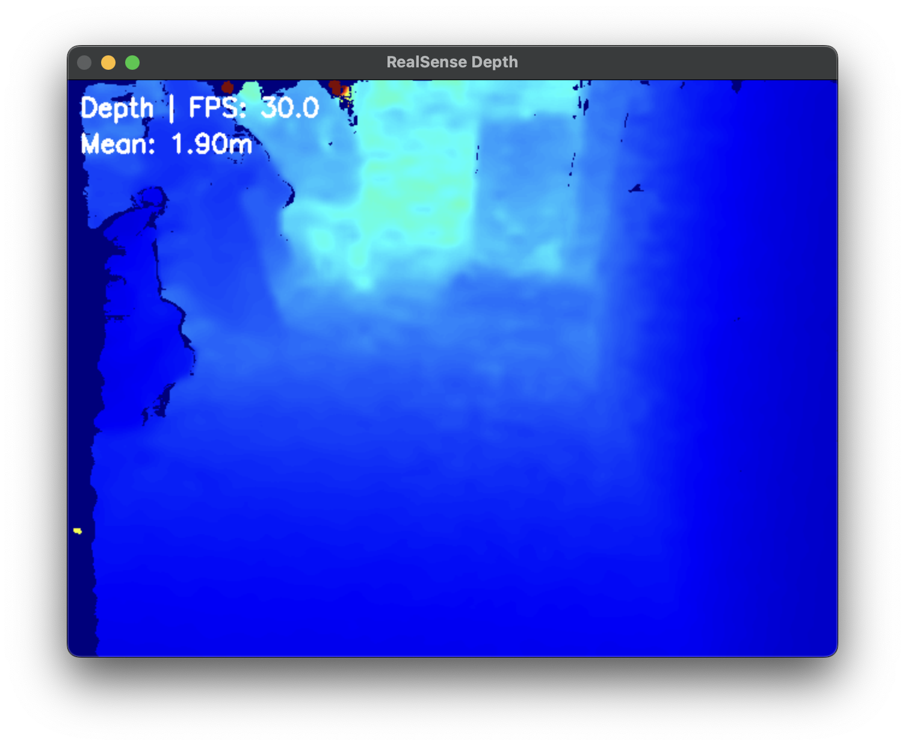

# 📷 Intel RealSense D435i

Real-time RGB-D camera streaming on Unitree G1 (Jetson Orin NX)

<table>
<tr>
<td width="50%">

**RGB Stream**


</td>
<td width="50%">

**Depth Stream (Colormap)**



</td>
</tr>
</table>

## 📋 Project Goal

Capture RGB + Depth from RealSense D435i on Jetson → Compress → Packetize → Stream via UDP to Mac → Display in real-time

Same pattern as LiDAR viewer: simple UDP approach for rapid prototyping

---

## 📂 Project Structure

```
RealSense/
├── examples/
│   ├── 00_check_camera.py       # Camera detection and verification
│   ├── 01_basic_capture.py      # Local test (frame capture + analysis)
│   ├── 02_stream_sender.py      # Jetson → Mac sender (compression + packetization)
│   └── 03_stream_receiver.py    # Mac receiver and display
└── README.md
```

---

## 🔄 Data Flow

```
+--------------------------------------------------------------+
| Jetson (Robot)                                               |
|                                                              |
|  RealSense D435i                                             |
|     ├─ RGB (640x480 BGR)  ──┐                                |
|     └─ Depth (640x480 mm)   │                                |
|                             v                                |
|  02_stream_sender.py                                         |
|     ├─ JPEG compression (RGB: 900KB → 22KB)                  |
|     ├─ PNG compression (Depth: 600KB → 190KB)                |
|     ├─ Packet fragmentation (60KB chunks)                    |
|     └─ UDP socket ────────────────────────────────────────┐  |
+--------------------------------------------------------------+
                                                            |
                                                            | UDP 8889 (RGB)
                                                            | UDP 8890 (Depth)
                                                            |
+--------------------------------------------------------------+
| Mac (Ground Station)                                      |  |
|                                                           |  |
|  03_stream_receiver.py                                    |  |
|     ├─ UDP socket ◄───────────────────────────────────────┘  |
|     ├─ Packet reassembly                                     |
|     ├─ JPEG/PNG decoding                                     |
|     └─ OpenCV display                                        |
|         ├─ RGB window                                        |
|         └─ Depth (colormap) window                           |
+--------------------------------------------------------------+
```

---

### ✅ Phase 1: Local Testing

**00_check_camera.py**
- Detect RealSense device
- Verify USB connection
- Test basic frame capture
- 30-frame warm-up (prevent Device Busy)

**01_basic_capture.py**
- Capture RGB + Depth frames
- Detailed statistics (depth distribution, color channels, etc.)
- Display sample pixel values
- Screen display only (no file saving)

**Purpose:** Verify camera functionality and data

---

### ✅ Phase 2: Network Streaming

**02_stream_sender.py** (Jetson)
- RealSense initialization with 30-frame warm-up
- **JPEG compression** (RGB: 85% quality, ~22KB)
- **PNG compression** (Depth: lossless 16-bit, ~190KB)
- **Packet fragmentation** (60KB chunks, avoid UDP limits)
- UDP transmission to Mac (separate ports)
- Real-time FPS and bandwidth display

**03_stream_receiver.py** (Mac)
- UDP packet reception (multi-threaded)
- **Packet reassembly** (sequence_id + chunk_index)
- JPEG/PNG decoding
- OpenCV real-time display
- FPS and depth statistics overlay

**Key Technologies:**
- Compression reduces bandwidth by 97% (900KB → 22KB)
- Packet fragmentation solves UDP size limits
- Lossless depth transmission (PNG 16-bit)

---

## 🚀 Usage

### Prerequisites

#### Install RealSense SDK (Jetson, one-time)

**Build librealsense:**
```bash
git clone https://github.com/IntelRealSense/librealsense.git
cd ~/librealsense

# Build with Python bindings
mkdir build && cd build
cmake .. -DBUILD_PYTHON_BINDINGS:bool=true
make -j$(nproc)
sudo make install
```

**Note:**
- Build time: ~10-15 minutes (Jetson Orin NX)
- `-DBUILD_PYTHON_BINDINGS:bool=true` required for Python bindings
- Official docs: https://github.com/IntelRealSense/librealsense

#### Install Python Packages

**Jetson (Robot):**
```bash
pip3 install pyrealsense2 numpy opencv-python
```

**Mac (Ground Station):**
```bash
pip3 install numpy opencv-python
```

### Run

**1. Check camera connection (Jetson):**
```bash
cd /home/unitree/AIM-Robotics/RealSense/examples
python3 00_check_camera.py
```

**2. Local capture test (Jetson, optional):**
```bash
python3 01_basic_capture.py
```

**3. Start streaming (Jetson):**
```bash
python3 02_stream_sender.py
```

**Note:** Set `MAC_IP` variable to Mac's **wired IP**!
```python
# 02_stream_sender.py
MAC_IP = "192.168.123.99"  # Mac wired IP
```

**4. Receive and display (Mac):**
```bash
# Copy 03_stream_receiver.py to Mac, then:
python3 03_stream_receiver.py
```

Exit: `q` key or `Ctrl+C`


## ⚙️ Configuration

```python
# 02_stream_sender.py
MAC_IP = "192.168.123.99"  # Mac IP (wired recommended!)
RGB_PORT = 8889           # RGB stream port
DEPTH_PORT = 8890         # Depth stream port
CHUNK_SIZE = 60000        # 60KB chunks (UDP safe size)

# Stream settings
Width: 640
Height: 480
FPS: 30

# Compression settings
JPEG Quality: 85          # RGB compression
PNG: Lossless 16-bit      # Depth lossless
```

---

## 🎨 Depth Visualization

Convert depth to JET colormap:

```python
# Normalize 0-10m range to 0-255
depth_normalized = np.clip(depth_image / 10000.0 * 255, 0, 255).astype(np.uint8)
depth_colormap = cv2.applyColorMap(depth_normalized, cv2.COLORMAP_JET)
```

**Color Meaning:**
- 🔵 Blue/Purple: Close (0-2m)
- 🟢 Green/Yellow: Medium (2-5m)
- 🔴 Red: Far (5-10m)

---

## 📷 Camera Info

**Detected Device:**
```
Name:           Intel RealSense D435I
Serial:         335522070701
Firmware:       5.13.0.55
USB Type:       3.2 (USB 3.1 port)
```

**Available Sensors:**
- Stereo Module (Depth sensor)
- RGB Camera (Color image)
- Motion Module (IMU - gyro/accelerometer)

**Tested Streams:**
- Depth: 640x480 @ 30fps (16-bit, millimeters)
- Color: 640x480 @ 30fps (8-bit BGR)

---

## 🔧 Troubleshooting

### Camera not detected

```bash
# Check USB connection
lsusb | grep -i intel
# Output should show: 8086:0b3a Intel Corp.

# Verify USB 3.0 port
# Check camera access
python3 00_check_camera.py
```

### "Device or Resource Busy" error

**Cause:** Camera resource not fully released

**Solution:**
1. Wait 0.5s after script exit (auto-implemented)
2. 30-frame warm-up before capture (auto-implemented)
3. Reconnect USB

```bash
# Force kill process (if needed)
pkill -9 python3
```

### "Network is unreachable" error

**Cause:** Incorrect Mac IP or network disconnected

**Check IP on Mac:**
```bash
# Show all network IPs
ifconfig | grep "inet " | grep -v 127.0.0.1

# Example output:
#   inet 10.40.100.105 netmask ...   <- WiFi (wireless)
#   inet 192.168.123.99 netmask ...   <- Ethernet (wired) ✅ Use this!
```

**Update 02_stream_sender.py:**
```python
MAC_IP = "confirmed_wired_IP"  # e.g., "192.168.123.99"
```

### WiFi overload causing disconnection

**Cause:** RGB + Depth = ~6 MB/s sustained, WiFi vulnerable to interference/latency

**Solution: Use wired network**

**Alternatives (if wired unavailable):**
1. **Lower frame rate:**
   ```python
   config.enable_stream(rs.stream.depth, 640, 480, rs.format.z16, 15)  # 30 → 15
   ```

2. **Reduce JPEG quality:**
   ```python
   cv2.imencode('.jpg', color_image, [cv2.IMWRITE_JPEG_QUALITY, 70])  # 85 → 70
   ```

3. **Lower resolution:**
   ```python
   config.enable_stream(rs.stream.depth, 320, 240, ...)  # 640x480 → 320x240
   ```

### Test network connection

```bash
# On Mac, run UDP listener:
nc -ul 8889

# On Jetson, send test packet:
echo "test" | nc -u 10.40.100.105 8889
```

---

## 📚 References

**vibes project:**
- `/home/unitree/unitree_g1_vibes/stream_realsense.py` - Full-featured local viewer
- `/home/unitree/unitree_g1_vibes/jetson_realsense_stream.py` - GStreamer streaming
- `/home/unitree/unitree_g1_vibes/receive_realsense_gst.py` - GStreamer receiver

**librealsense examples:**
- `/home/unitree/unitree_g1_vibes/librealsense/wrappers/python/examples/`

**Project pattern:**
- LiDAR viewer: `/home/unitree/AIM/LiDAR/`

---

## 💡 TODO

- [ ] Introduce H.264/H.265 codec (consider when WiFi stability improves, bandwidth 6MB/s → 1-2MB/s)
- [ ] GStreamer + NVENC integration (GPU hardware acceleration)
- [ ] IMU data integration
- [ ] Multi-camera support

**Note:** Current JPEG+PNG approach is sufficiently stable. Consider codec only if WiFi disconnection issues occur.

---

Made with 💡 by AIM Robotics
