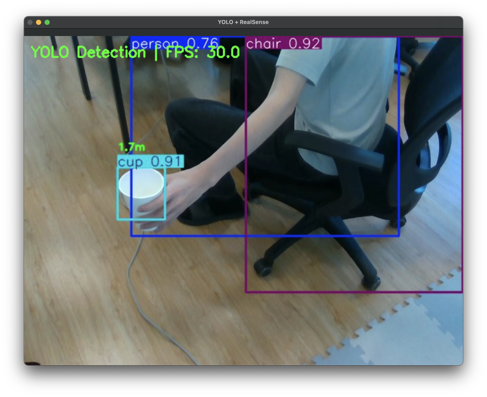

# YOLOv8 + RealSense Real-time Object Detection & Streaming

Real-time object detection on Unitree G1 using Intel RealSense D435i and YOLOv8, with UDP streaming to Mac for visualization.



## Project Goal

Detect objects in real-time using YOLOv8 on Jetson Orin NX, combine with depth data from RealSense D435i, and stream annotated video to Mac for visualization.

---

## Data Flow

```
+--------------------------------------------------------------+
| Jetson Orin NX (Robot)                                       |
|                                                              |
|  RealSense D435i                                             |
|     ├─ RGB (640x480 BGR)                                     |
|     └─ Depth (640x480 mm)                                    |
|          ↓                                                   |
|  YOLOv8 Inference (GPU)                                      |
|     ├─ Object detection (bounding boxes)                     |
|     ├─ Class labels (80 COCO classes)                        |
|     └─ Confidence scores                                     |
|          ↓                                                   |
|  Annotated Image                                             |
|     ├─ Bounding boxes + labels                               |
|     └─ Distance overlay (from depth)                         |
|          ↓                                                   |
|  JPEG Compression (~30KB)                                    |
|          ↓                                                   |
|  UDP Streaming (port 8889) ─────────────────────────────┐    |
+--------------------------------------------------------------+
                                                           |
                                                           | UDP 8889
                                                           |
+--------------------------------------------------------------+
| Mac (Ground Station)                                    |    |
|                                                         |    |
|  UDP Receiver ◄─────────────────────────────────────────┘    |
|     ├─ Packet reassembly                                     |
|     └─ JPEG decoding                                         |
|          ↓                                                   |
|  OpenCV Display                                              |
|     └─ Real-time visualization                               |
+--------------------------------------------------------------+
```

---

## Project Structure

```
YOLOv8n/
├── jetson_yolo_sender.py      # Jetson: RealSense + YOLO + UDP sender
├── mac_yolo_receiver.py       # Mac: UDP receiver + visualization
└── README.md                  # This file
```

---

## Features

### jetson_yolo_sender.py (Jetson)

- **RealSense D435i integration**: RGB + Depth capture (640x480 @ 30fps)
- **YOLOv8 inference**: Object detection with GPU acceleration
- **Depth integration**: Displays distance to detected objects
- **JPEG compression**: ~30x bandwidth reduction (921KB raw → 30KB compressed)
- **UDP streaming**: Packetized transmission to Mac
- **Real-time FPS display**: Performance monitoring

### mac_yolo_receiver.py (Mac)

- **UDP reception**: Multi-threaded packet reassembly
- **JPEG decoding**: Fast image reconstruction
- **OpenCV display**: Real-time visualization
- **FPS overlay**: Performance monitoring

---

## Prerequisites

### Jetson Orin NX (Robot)

**Hardware:**
- Intel RealSense D435i
- Network connection (WiFi or Ethernet)

**Software:**
```bash
# Required packages:
pip3 install ultralytics pyrealsense2 numpy opencv-python
```

**Important - GPU Acceleration:**

YOLOv8 requires CUDA-enabled PyTorch for real-time performance. Standard `pip install torch` installs CPU-only version which is ~10x slower.

```bash
# Verify CUDA is available:
python3 -c "import torch; print(f'CUDA available: {torch.cuda.is_available()}')"

# If CUDA is False, install Jetson PyTorch wheel:
# See /home/unitree/AIM-Robotics/README.md "GPU Setup" section
```

**Performance without GPU:**
- CPU: ~400-500ms per frame → 2-3 FPS ❌
- GPU: ~23ms per frame → 30 FPS ✅

### Mac (Ground Station)

**Software:**
```bash
# Install Python packages
pip3 install numpy opencv-python
```

**Network:**
- Same network as Jetson (WiFi or wired)
- Firewall allow UDP port 8889

---

## Usage

### 1. Configure Network

**Get Mac IP address:**
```bash
# On Mac terminal
ifconfig | grep "inet " | grep -v 127.0.0.1

# Example output:
#   inet 10.40.100.86 netmask ...   <- WiFi
#   inet 192.168.123.99 netmask ... <- Ethernet (recommended)
```

**Update Jetson sender script:**
```python
# Edit jetson_yolo_sender.py
MAC_IP = "10.40.100.86"  # Replace with your Mac IP
```

### 2. Start Streaming (Jetson)

```bash
cd /home/unitree/AIM-Robotics/YOLOv8n
python3 jetson_yolo_sender.py
```

**Expected output:**
```
============================================================
YOLOv8 + RealSense Network Streaming - Sender
============================================================

Configuration:
  Target IP:    10.40.100.86
  RGB Port:     8889
  Resolution:   640x480 @ 30fps
  YOLO Model:   yolov8n.pt
  YOLO Conf:    0.5
  Chunk size:   60KB
============================================================

[1/5] Initializing UDP socket...
  ✓ RGB socket created (target: 10.40.100.86:8889)

[2/5] Loading YOLO model...
  ✓ YOLOv8 model loaded: yolov8n.pt
  - Classes: 80 (COCO dataset)
  - Device: CUDA

[3/5] Initializing RealSense...
  - Depth stream: 640x480 @ 30fps (z16)
  - Color stream: 640x480 @ 30fps (bgr8)

[4/5] Starting RealSense pipeline...
  ✓ Pipeline started
  - Stabilizing camera...
  ✓ Camera stabilized

[5/5] Streaming frames with YOLO detection...
============================================================
Press Ctrl+C to stop
============================================================
Frame   123 | FPS:  29.7 | YOLO:  22.9ms | Objects:  2 | Size: 30.7KB
```

### 3. Receive and Display (Mac)

```bash
# Copy mac_yolo_receiver.py to Mac, then:
python3 mac_yolo_receiver.py
```

**Expected output:**
```
============================================================
YOLOv8 + RealSense Network Streaming - Receiver
============================================================

Configuration:
  RGB Port:     8889
  Listening on: 0.0.0.0 (all interfaces)
============================================================

Starting receiver thread...
✓ RGB receiver listening on port 8889

============================================================
Waiting for YOLO frames...
Press 'q' to quit
============================================================
Frames:   123 | FPS:  29.7
```

**Display window:**
- Real-time video with YOLO detections
- Bounding boxes around objects
- Class labels (person, cup, chair, etc.)
- Distance information (meters)
- FPS counter

---

## Configuration

### YOLO Settings (jetson_yolo_sender.py)

```python
# Model selection
YOLO_MODEL = "yolov8n.pt"  # Options: yolov8n, yolov8s, yolov8m, yolov8l, yolov8x

# Confidence threshold
YOLO_CONF = 0.5  # Range: 0.0-1.0 (higher = fewer false positives)
```

**Model Comparison:**

| Model    | Speed (FPS) | Accuracy | Size  | Recommended Use    |
|----------|-------------|----------|-------|--------------------|
| yolov8n  | ~30         | Good     | 6MB   | Real-time (default)|
| yolov8s  | ~20         | Better   | 22MB  | Balanced           |
| yolov8m  | ~10         | High     | 52MB  | Accuracy priority  |

### Network Settings

```python
# jetson_yolo_sender.py
MAC_IP = "192.168.123.99"  # Mac IP address
RGB_PORT = 8889            # UDP port
CHUNK_SIZE = 60000         # 60KB chunks (safe for UDP)

# Compression
JPEG_QUALITY = 85          # Range: 0-100 (higher = better quality)
```

---

## YOLO Classes

YOLOv8 detects 80 common objects from the COCO dataset:

**People & Animals:**
- person, cat, dog, horse, bird, etc.

**Vehicles:**
- car, bus, truck, bicycle, motorcycle

**Everyday Objects:**
- cup, bottle, chair, couch, keyboard, laptop, cell phone

**Food:**
- apple, banana, pizza, cake, etc.

**List all classes:**
```python
from ultralytics import YOLO
model = YOLO('yolov8n.pt')
print(model.names)
# {0: 'person', 1: 'bicycle', 2: 'car', ...}
```

---

## Performance

### Actual Tested Performance (Jetson Orin NX 16GB)

**Hardware:**
- Device: Jetson Orin NX 16GB
- JetPack: 5.1.1 (L4T R35.3.1)
- CUDA: 11.4
- PyTorch: 2.1.0 (CUDA-enabled)

**YOLOv8n (nano) Results:**
- YOLO Inference: ~23ms per frame
- Overall FPS: ~30 (29.7 average)
- JPEG Size: ~30KB per frame
- Objects detected: 1-3 per frame (typical scene)

**Network:**
- Bandwidth: ~900KB/s (JPEG 85% quality, 30KB×30fps)
- Latency: <100ms (local network, estimated)

**Tips for better performance:**
1. Use wired connection (more stable than WiFi)
2. Lower JPEG quality if network is slow
3. Increase confidence threshold to reduce detections

---

## Troubleshooting

### Camera not detected

```bash
# Check RealSense connection
lsusb | grep -i intel  # Should show: 8086:0b3a

# Test camera
cd /home/unitree/AIM-Robotics/RealSense/examples
python3 00_check_camera.py
```

### Low FPS / Slow performance

**Check GPU acceleration:**
```bash
# Verify CUDA is enabled
python3 -c "import torch; print(f'CUDA: {torch.cuda.is_available()}')"

# If False, see Prerequisites section for PyTorch GPU setup
```

**If GPU is enabled but still slow:**
- Check network bandwidth: Use Ethernet instead of WiFi
- Lower JPEG quality in `jetson_yolo_sender.py` line 202: `cv2.IMWRITE_JPEG_QUALITY, 70`
- Increase confidence threshold to detect fewer objects

### Network connection issues

```bash
# Test connectivity
ping <TARGET_IP>

# Check firewall (Mac)
sudo /usr/libexec/ApplicationFirewall/socketfilterfw --setglobalstate off

# Verify MAC_IP in jetson_yolo_sender.py matches your Mac's IP
ifconfig | grep "inet "  # Run on Mac
```

---

## Example Output

**Console (Jetson):**
```
Frame  15708 | FPS:  29.7 | YOLO:  22.9ms | Objects:  2 | Size: 30.7KB
Frame  15739 | FPS:  29.7 | YOLO:  22.9ms | Objects:  1 | Size: 29.5KB
```

**Console (Mac):**
```
Frames:  15708 | FPS:  29.7
```

**Display Window (Mac):**
```
┌────────────────────────────────┐
│  [person] 0.92                 │  <- Bounding box + confidence
│  2.3m                          │  <- Distance from depth
│                                │
│    ┌─────────┐                 │
│    │  [cup]  │ 0.78            │
│    │  0.8m   │                 │
│    └─────────┘                 │
│                                │
│  YOLO Detection | FPS: 28.2    │  <- FPS overlay
└────────────────────────────────┘
```

---

## Future Enhancements

- [ ] Object tracking (assign IDs across frames)
- [ ] Save detections to log file (JSON format)
- [ ] VLM/LLM integration (send scene to GPT-4V/Claude)
- [ ] Robot control integration (follow detected person)
- [ ] Multi-camera support
- [ ] Custom YOLO model training

---

## References

**Related Projects:**
- RealSense streaming: `/home/unitree/AIM-Robotics/RealSense/`
- LiDAR visualization: `/home/unitree/AIM-Robotics/LiDAR/`
- SLAM system: `/home/unitree/AIM-Robotics/SLAM/`

**Documentation:**
- [Ultralytics YOLOv8](https://docs.ultralytics.com/)
- [RealSense D435i](https://www.intelrealsense.com/depth-camera-d435i/)
- [Jetson Orin NX](https://developer.nvidia.com/embedded/jetson-orin)

---

Made with 💡 by AIM Robotics
